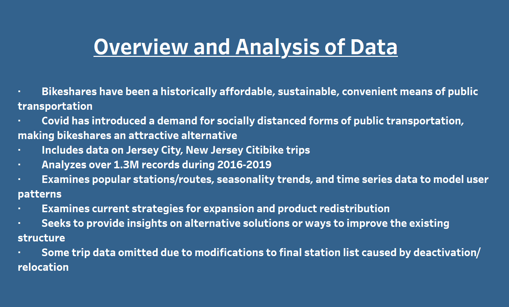
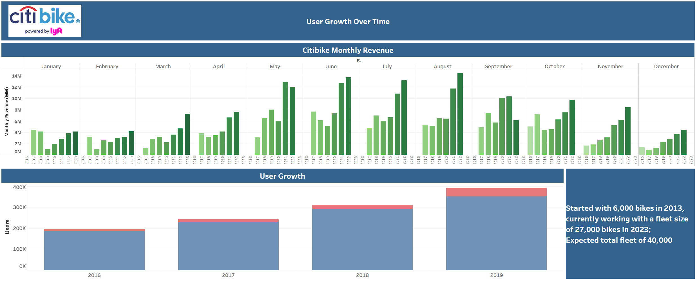
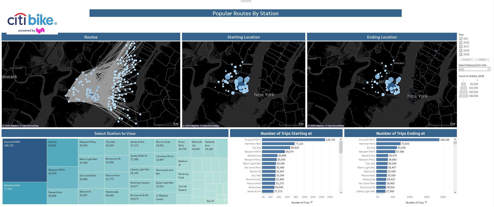
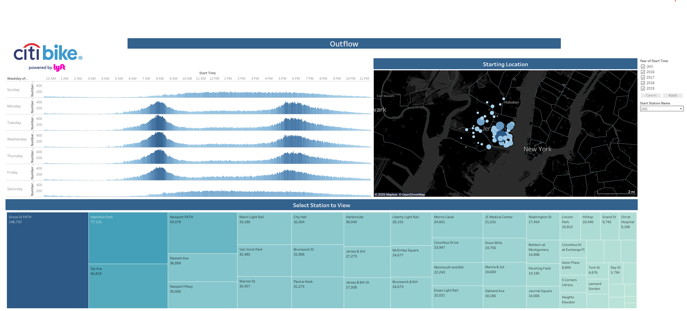

# CitibikeProject

Since many people do not have access to a Tableau license, TableauPublic is a free public hosting site for Tableau workbooks (owned by SalesForce, Inc.)

The following is a link to my public profile where you can access the workbook:

https://public.tableau.com/views/CitibikeProject-PhilDaniel/Story1?:language=en-US&:sid=&:redirect=auth&:display_count=n&:origin=viz_share_link

Alternatively you can visit https://public.tableau.com/app/discover and search for my name Phil Daniel.

Project completed during a 3 month immersive Data Analytics course from General Assembly.

Students were tasked to analyze a large dataset (1.3M+ records) containing route information collected from users by several RideShare companies.

Skills emphasized:

Python (Jupyter Notebook):
  - pandas
  - numpy
  - matplotlib
  - Data cleaning
  - aggregations
  - function statements

SQL (PostgreSQL):
  - Join statements
  - Union statements
  - Aliasing
  - denserank()
  - case statements
  - rank by
  - like
  - wildcard (%)
  - if and when statements

Microsoft powerpoint:
  - Creating project status reports through focused powerpoint presentations
  - Simulated status update meetings by presenting our work with peers

Tableau:
  - Used tableau to visualize the findings of my analysis and create a story and provide feedback/actionable suggestions such as redistributing bike inventory before peak times, suggesting ideal areas for expansion due to demand and proximity to social hubs, with external analysis of publicly available financial reports.

The project was done over the course of two weeks while simultaneously learning many of skills that were required to complete the project (that were new to me at the time).
If I were to do this project again I would clean the data using Python and perform my queries in SQL, using PowerBI to visualize it since Tableau while very powerful and user friendly, requires substantial investment from companies and individuals.

